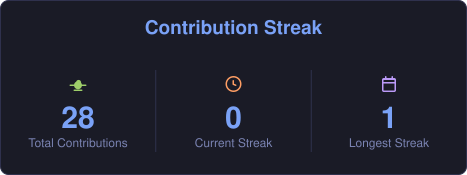
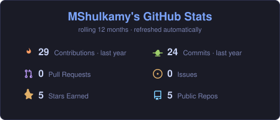
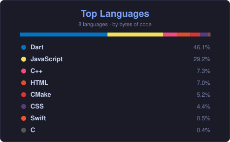
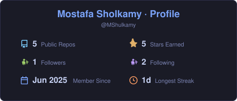
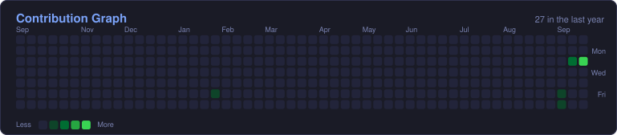

  

  
  
  

---

## 👋 About Me

I build **Flutter** apps and **full-stack web** products end to end — from the data layer up to the UI — and I care about the boring parts: offline-first storage, clean architecture, and a dashboard you can actually administer from.

- 📱 **Flutter** — Clean Architecture · Riverpod · Provider · custom-painted charts · full Arabic RTL
- 🌐 **Front-End** — HTML · CSS · JavaScript · responsive, accessible layouts
- ☁️ **Cloudflare** — Pages · Functions · D1 · R2 — shipping complete products at **$0/month**
- 🔐 **Security** — PBKDF2-SHA256 auth, CSRF protection, rate limiting, strict input whitelists
- 🎓 Engineering & Computer Science student
- 📍 Cairo, Egypt · open to Flutter roles

---

## 🛠️ Tech Stack

**Mobile — Flutter & Dart**

      

**Web — Front-End & Backend**

    

**Tools & Environment**

     

---

## 🚀 Featured Projects

<table>
<tr>
<td width="50%" valign="top">

### 💰 Mizan
An **offline-first personal finance tracker**. Local SQLite storage, custom-painted charts, Riverpod state management and a complete Arabic RTL interface.

`Flutter` `Riverpod` `sqflite`

[**→ Repository**](https://github.com/MShulkamy/mizan) · [**Live demo**](https://mizan-demo.pages.dev)

</td>
<td width="50%" valign="top">

### ☁️ Cloudflare Portfolio
A full-stack portfolio site with a built-in **admin dashboard** — Pages Functions, D1 and R2, with PBKDF2 auth, CSRF protection and rate limiting. Runs entirely on the free tier.

`Cloudflare` `JavaScript` `SQLite`

[**→ Repository**](https://github.com/MShulkamy/cloudflare-portfolio) · [**Live demo**](https://cloudflare-portfolio-d49.pages.dev)

</td>
</tr>
<tr>
<td width="50%" valign="top">

### 🍽️ FoodAtlas
Recipe & grocery-cart app in Flutter using **Clean Architecture (MVC)** — Firebase Auth, Cloud Firestore, a full Arabic RTL UI and dark mode.

`Flutter` `Firebase` `Provider`

[**→ Repository**](https://github.com/MShulkamy/foodatlas) · [**Live demo**](https://foodatlas-demo.pages.dev)

</td>
<td width="50%" valign="top">

### 🛍️ Fashion Store
Production-ready **e-commerce** app in Flutter — Clean Architecture, Provider, Firebase Auth, Firestore profiles and a dynamic light/dark theme.

`Flutter` `Firebase` `REST API`

[**→ Repository**](https://github.com/MShulkamy/final_project) · [**Live demo**](https://fashion-store-demo.pages.dev)

</td>
</tr>
</table>

---

## 📊 GitHub Analytics

<!-- Rendered from the GitHub API by scripts/build-cards.mjs into assets/*.svg and
     committed by .github/workflows/update-cards.yml. They are static files served
     from GitHub's own CDN, so no third-party card service can rate-limit them. -->

  

  

  

  

---

## 📈 Contribution Graph

  

---

### 📫 Let's Connect

[Portfolio](https://mostafa-portfolio.pages.dev) · [LinkedIn](https://www.linkedin.com/in/mostafa-sholkamy-234238390) · [Email](mailto:mostafasholkamy50@gmail.com)

⭐ If you like my work, consider starring my repositories — it means a lot!

